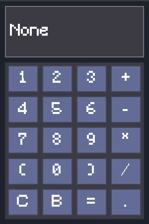

# Scal - ~~Simple~~ Silly Calculator
Scal - (simple or silly, you decide) graphical calculator, written in C.
Scal was made to test two very cool technologies: `Nob.h` - evolution of "No Build" idea, made by [Tsoding](https://github.com/tsoding/nob.h), and [C Layout](https://github.com/nicbarker/clay) library made by nicbarker. 
Also i wanted to expiriment with how prasing works, since i couldn't get my head around it in first few tries.

# "Features"

- Responisve immidiate-style User Interface with "Cobalt" theme.
- Simple Recusrive-Descent parser for expression evaluation
- Keyboard input support
- Plug-In font loading (Might be buggy)

# Getting stated

You can grab prebuild binaries with default font included in [Releases](https://github.com/amuerta/scal/releases) Page. There are pre-build binaries for x86_64 Windows and Linux (Posix).

Otherwise you can build it yourself.

# Building

**Requirements:**
- clang compiler for linux / mingw for windows

## Steps:

1. Grab source code from git via `git clone --depth 1 https://github.com/amuerta/scal` or download it from webpage.

2. Navigate to repo root directory where all files all source files are sotred

3. Compile build.c "build-script" using command `cc -o build build.c`

4. Run it with appropriate target selected:
    - Windows: `./build release windows`
    - Posix(linux): `./build release linux`

Optionally you can specifiy no font loading, by adding `--default-font` at the end of the build command.

5. Test produced executable `./build_output/scal(.exe for windows)`

## NOTE:

Calculator expects for a `./assets/AppFont.ttf` to exist somewhere near it. Its hardcoded path, thus you have to either create a softlink to the directory to the font, or a link to the executable.

If no font found, calculator will use default raylib font, which due to some bizzare Clay sizing WILL overlap its glyphs.

# Funny features:

Since Scal has error-handling system, it will show `Syntax error` when you provide invalid input expression. You might enter expression like `-1` and get an error, even tho the expression is valid. That happens because Scal uses simplified parser grammar, where it would expect an expression with two operands, to acomidate this, just put whenever you need to have negative number:

Invalid Expr:
    `-1`

Valid Expr:
    `0-1`

Expressions with just numbers like `(10)`, `10`, `10+` will evaluate without error.

# Demo:

